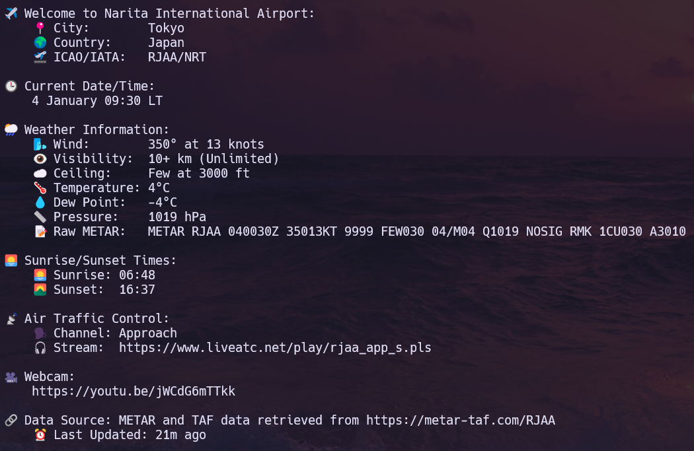

<div align="center">

# lofiatc.ps1
a [lofiatc](https://www.lofiatc.com) alternative using PowerShell and VLC/Potplayer, allowing you to listen to Lofi Girl and Air Traffic Control from around the world simultaneously


</div>

<br>


# Demo

## Using fuzzy finder


## Using default input/output


## Airport Info


<br>

# Gettings Started

## Requirements
- A media player, currently only the following players are supported:
  - VLC Media Player: `winget install -e --id VideoLAN.VLC`)
  - Potplayer: `winget install potplayer --id Daum.PotPlayer -s winget`
  - MPC-HC: `winget install MPC-HC --id clsid2.mpc-hc`
  - MPV: `scoop install mpv` or via [mpv.io](https://mpv.io/installation/)
- PowerShell 5.1 or later
- fzf (optional) but required if you wanna use fzf (Can also be installed via winget: `winget install --id=junegunn.fzf  -e`)

## Clone repo locally
```powershell
git clone https://github.com/RoMinjun/lofiatc.ps1.git
```

## Run script
```powershell
.\lofiatc.ps1
```

> [!TIP]
Check the possibilities of the script using `Get-Help` 
```powershell
Get-Help .\lofiatc.ps1 -Full
```